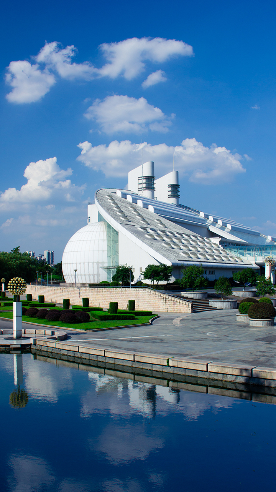

## 使用Python画素描

我是用线条为单位进行素描的，并且增加了随机函数，使得线条长度不确定， 
这样创作的素描画看上去更柔和，也更接近真实的人类作画的风格。  
现在把代码修改为使用numpy，只要20行就能实现这个功能，效果还更好。  
第一张是原图   
 
第二张是原先的代码画的   
 
第三张是修改后的代码画的   
   
修改后的代码见Python素描.py，老的代码见code.py     
